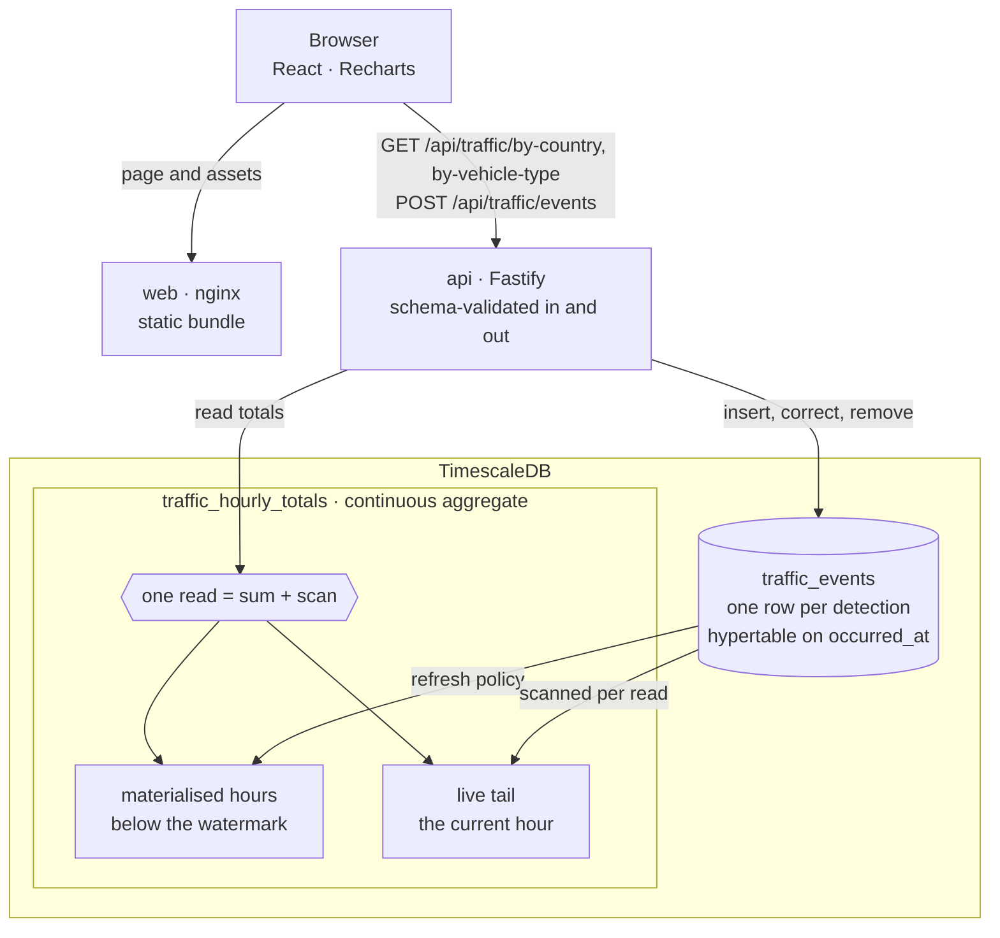

# Traffic dashboard

Vehicle detections stored at their raw grain, aggregated by TimescaleDB, served
over HTTP, and drawn as two ranked charts.

**Live: <https://traffic.freehire.me>** — 250 000 seeded detections, behind
nginx on a single host. The frontend and the API share that one origin, so the
browser never makes a cross-origin request.



One read of an aggregate is the sum of the materialised hours plus a live scan
of the current one. That split is why 500 RPS is cheap, why the bucket is an
hour wide rather than a day, and what bounds how stale an answer can be.

## Run it

```bash
docker compose up --build
```

Then open <http://localhost:8080>; the API is on <http://localhost:3000>. If
either port is taken, copy `.env.example` to `.env` and set `API_PORT` /
`WEB_PORT` — the origin the bundle is built against and the one the API allows
both follow.

The first start migrates, converts the events table to a hypertable, and seeds
250 000 detections (`SEED_EVENTS` changes that); from an empty volume it took 7 s
here. A restart does not re-seed: the seed runs only when the table is empty.

```bash
pnpm install                     # without Docker:
pnpm --filter @derq/api dev      # needs DATABASE_URL
pnpm --filter @derq/web dev

pnpm verify                      # lint, typecheck, tests — 298: 192 api, 106 web
```

Integration suites start a throwaway TimescaleDB with Testcontainers on the image
Compose runs, so Docker must be running; nothing is mocked at the database
boundary, because the behaviour worth testing there is the SQL. The three levels
the suite sits at: [docs/architecture.md](docs/architecture.md#tests-and-the-three-levels-they-sit-at).

## API

| Method | Path | |
|---|---|---|
| GET | `/api/health` | process and database reachability |
| GET | `/api/traffic/by-country` | totals per plate country, largest first; optional `from`, `to` |
| GET | `/api/traffic/by-vehicle-type` | totals per vehicle type, largest first; optional `from`, `to`, `country` |
| POST | `/api/traffic/events` | record a batch of detections |
| PATCH | `/api/traffic/events/:id` | correct a detection's classification |
| DELETE | `/api/traffic/events/:id` | remove a detection |

Lists answer `{"data": [...]}`, failures answer `{"error": "..."}`. A 5xx never
carries the underlying message: a driver failure names the host, the user, and
why authentication failed.

```bash
curl -X POST localhost:3000/api/traffic/events \
  -H 'content-type: application/json' \
  -d '{"events":[{"plateCountry":"AE","vehicleType":"bus"}]}'
# {"data":{"recorded":1}}

curl -X POST localhost:3000/api/traffic/events \
  -H 'content-type: application/json' \
  -d '{"events":[{"plateCountry":"Oman","vehicleType":"truck"}]}'
# {"error":"body/events/0/plateCountry must match pattern \"^[A-Z]{2}$\""}

curl 'localhost:3000/api/traffic/by-country?from=2026-03-04T13:30:00Z'
# {"data":[...],"period":{"from":"2026-03-04T13:00:00.000Z"}}
```

A period is the half-open interval `[from, to)`. Totals are hourly, so a bound
partway through an hour is rounded **outward** and the response states the period
it covered — narrowing instead would under-report and look exactly like a quiet
stretch of traffic. `country` narrows the vehicle-type aggregate only; on
`by-country` it is a 400 rather than a silently unfiltered answer.

## Architecture

**One row per detection**, never hourly counts: aggregation is one-way, so the
grain is what every later question depends on. Constraints live in the database,
requests and responses are declared as schemas, and rows are validated on the way
out of the driver as well as in. **Aggregates are maintained, not computed** —
the endpoints sum over `traffic_hourly_totals` and never count events.

The dashboard is two ranked bar charts rather than a pie, each panel owning its
state and its retry, the filter in the URL, and a form that records a detection
through the same `POST` a camera would use — reasoning for each in
[docs/architecture.md](docs/architecture.md).

```
api/src/traffic/      domain/, http/, infra/ — a vertical slice, where domain/ knows
                      nothing and the other two name ports.ts rather than each other
api/src/platform/     config, database, migrations, server, health, shutdown
web/src/              React 19, Vite, Recharts, zod
perf/ docs/ openspec/ k6 scripts · measurements and the ADR · one change per increment
```

`openspec/` is the record of how this was built: each increment proposed and
specified before it was written, its spec in `openspec/specs`, and the archived
changes carrying the reasoning — including decisions later measured to be wrong.

## Scaling: 5 → 50 → 500 RPS

Measured with `k6` on this machine, not estimated — `RATE=500 k6 run
perf/aggregate-load.js`, an **open** model so an overloaded service does not read
as merely sluggish. Every tier is in [docs/performance](docs/performance).

- **5 and 50 RPS — nothing is required.** p95 23 ms and 13 ms, no failures. The
  first version of this project, counting every row on every request, passed both
  tiers too, at 49 ms and 21 ms. Tiers below the knee tell you almost nothing,
  which is why a single-point load test misleads.
- **500 RPS — where the design was decided.** That version failed **78 %** of
  requests with p95 pinned at 2.15 s, and not on the query: on getting a
  connection. Each aggregate held one for the length of a sequential scan, and
  2.15 s is `connectionTimeoutMillis` — the pool giving up, not a database
  answering. The fix was to stop running the query.

| | before | after |
|---|---|---|
| p95 at 500 RPS | 2.15 s | **4.4 ms** |
| failures at 500 RPS | 78 % | **0 %** |
| ceiling | ~150 RPS | ~1360 RPS |

Why an index cannot help, why a bigger pool makes it worse, why a cache is the
next step rather than this one, what a spike's 0.26 ms turned out to be worth,
and the thresholds after that — 100M rows, sustained writes, retention, reads
outgrowing one machine: [docs/adr/0001-timescaledb.md](docs/adr/0001-timescaledb.md).

Not measured: the write path's ceiling, and the filtered tiers, which are
plan-level measurements of the query rather than end-to-end p95 under
concurrency. The write path is also unauthenticated. Those are the first two
things a real deployment would need.

## Freshness, and its bound

A detection recorded now is counted now: the current hour is never materialised
and is served live. A detection that **arrives** late is counted when the refresh
policy next covers its hour, and that policy re-materialises a trailing seven days
every five minutes — seven days is therefore the stated maximum lateness for an
arrival, beyond which the total reads lower than the truth with no error anywhere.
Tests pin the policy's arguments for exactly that reason.

A correction or a removal has no such bound and errs the other way: real-time
aggregation adds rows above the watermark and never subtracts one below it, so a
mutation refreshes the hour it touched unless that hour is the current one. Both
directions, and the seam where a crash between write and refresh leaves a total
stale, are in [the ADR](docs/adr/0001-timescaledb.md#consequences).

## Deployment

Terraform describes the machine, `docker-compose.yml` describes what runs on it,
and neither describes the other. A push to `main` deploys the commit CI passed,
waits for `/api/health` to report the database up, and rolls back if it does not
within two minutes; the deploy key is restricted to a forced command that accepts
a commit sha and nothing else. [docs/deployment.md](docs/deployment.md).
